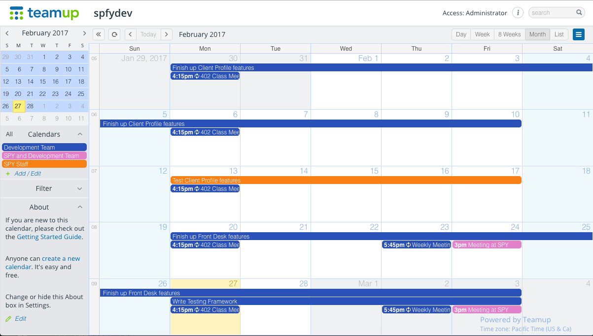

#4.0 Software Development Plan

##4.1 Plan Introduction
###4.1.1 Project Deliverables

- _Alpha - Nov 3rd_ - Preliminary version of the app. Our vision of what the app should start to look like based on all the meetings we have had with SPY about their needs and expectations
- _Beta - Dec 13th_ - After meeting with SPY with our alphas, we are ready to release the software to them for testing purposes, both with software stability and trying out the workflow
- _1.0 - Early January_ - We transfer ownership of the app over to SPY and take up a maintenance and additional features development role

##4.2 Project Resources

###4.2.1 Hardware Resources

  Resource           | Development   | Execution
  ------------------ | ------------- | -----------
  Macbook Computer   | ✓             | ✓
  2008 or newer machine | ✓ | ✓
  2 GB RAM | ✓ | ✓
  16 GB Storage | ✓ | ✓
  screen | ✓ | 
  Wifi connection | ✓ | 
  Ethernet connection | ✓ | ✓
  Linux Computer       |               | ✓
  Intel or ARM processor | ✓ | ✓
  2 GB RAM | ✓ | ✓
  16 GB Storage | ✓ | ✓
  screen | ✓ | 
  Wifi connection | ✓ | 
  Ethernet connection | ✓ | ✓

###4.2.2 Software Resources

  Resource              | Development   | Execution
  --------------------- | ------------- | -----------
  Google Chrome         | ✓             | ✓
  Sublime Text Editor   | ✓             |  
  PostgreSQL            | ✓             | ✓
  Node.js               | ✓             | ✓
  macOS                 | ✓             | ✓
  Windows OS            | ✓             | ✓
  Heroku                | ✓             | ✓
  GitHub                | ✓             | 
  Postico               | ✓             |
  Postman               | ✓             |

##4.3 Project Organization

###4.3.1 Organization Structure

The project demands integration between database, front end, and back end. Because of this, the organization of our teams follows each concept. There are three teams, one for each division, and Chris Franco manages overall compatibility and success.

###4.3.2 External Interfaces

Chris, the project instigator, is the main connection to SPY. He has set up communicative applications to allow SPY staff to access our team discussions and decisions. Additionally, our team records and outlines our in-person meetings.

###4.3.3 Roles and Responsibilities

Each week the development team meets 6-7:30 on Friday evenings. On Mondays, the development team meets with SPY staff at 3:30 to demonstrate current functionality and discuss dream-design.

  Name                        | Team        | Role
  --------------------------- | ----------- | ------------------
  Chris Franco                | Database    | Project Manager
  Chris Dellomes              | Database    | Database Dev
  Nicole Anguiano             | Front-end   | Front-end Lead
  Josh Kuroda                 | Front-end   | Front-end Design
  Lauren Konchan              | Front-end   | Front-end Beautify
  Mary Kate Reid              | Front-end   | Front-end Design
  Edward Seim                 | Back-end    | Back-end Lead
  Irakli Khizanishvili (Eko)  | Back-end    | Back-end Support
  Mondo Yamaguchi             | Back-end    | Back-end Support

##4.4 Project Schedule

###4.4.1 GANTT Chart

###4.4.2 Task / Resource Table

  Task                                               | People         | Hardware           | Software
  -------------------------------------------------- | -------------- | ------------------ | ----------------------------------------------
  New Drop In                                        | Lauren         | Macbook            | Node.js, Chrome, PostgreSQL, macOS, GitHub
  Edit Drop In                                       | Chris F        | Macbook            | Node.js, Chrome, PostgreSQL, macOS, GitHub
  List Drop Ins                                      | Ed             | Macbook            | Nodejs, PostgreSQL, macOS, Chrome, GitHub
  Add Client                                         | Chris F        | Macbook            | Node.js, Chrome, PostgreSQL, macOS,GitHub
  View Client Profile                                | Chris D        | Windows computer   | Node.js, GitHub, PostgreSQL, windowsOS,Chrome
  Search Client                                      | Eko            | Macbook            | Node.js, Chrome, PostgreSQL, macOS, GitHub
  Look & Feel                                        | Josh, Lauren   | Macbook            | Node.js, Chrome, PostgreSQL, macOS, GitHub
  Client/Appointments/Drop-In Session Filter Table   | Nicole         | Macbook            | Node.js, Chrome, PostgreSQL, macOS, GitHub

###4.4.3 Class Schedule

-   [Week 01] (http://myweb.lmu.edu/bjohnson/cmsi401web1awk/week01-1.html)

    -   Meet & greet

    -   Introduction and Syllabus

    -   Generic Production Process Steps

    -   Parts of the Software Engineering Process

-   [Week 02](http://myweb.lmu.edu/bjohnson/cmsi401web1awk/week02-1.html)

    -   RFP Details

    -   Life Cycle Models

    -   Horror stories and Ethics

-   [Week 03](http://myweb.lmu.edu/bjohnson/cmsi401web1awk/week03-1.html)

    -   Project proposal presentations

    -   SOW Documents

    -   Needs Analysis

    -   Requirements Documents

    -   Peer Review Process

-   [Week 04](http://myweb.lmu.edu/bjohnson/cmsi401web1awk/week04-1.html)

    -   Software Development Plan

-   [Week 05](http://myweb.lmu.edu/bjohnson/cmsi401web1awk/week05-1.html)

    -   Brief Intro to UML

    -   Project Team Meetings and Coding for remainder of class

-   [Week 06](http://myweb.lmu.edu/bjohnson/cmsi401web1awk/week06-1.html)

    -   ValuJet Paper Discussion

    -   Architectural Design

    -   Design Reviews

    -   Project Team Meetings and Coding for remainder of class

-   [Week 07](http://myweb.lmu.edu/bjohnson/cmsi401web1awk/week07-1.html)

    -   Unit and Integration Test

    -   Review and Discussion of Deliverables

    -   Project Team Meetings and Coding for remainder of class

-   [Week 08](http://myweb.lmu.edu/bjohnson/cmsi401web1awk/week08-1.html)

    -   Special Guest Speaker: Daniel Manchala (more to come)

-   [Week 09](http://myweb.lmu.edu/bjohnson/cmsi401web1awk/week09-1.html)

    -   Student project status updates

    -   Preliminary Design Review (PDR) Presentations

    -   Project Team Meetings and Coding for remainder of class

-   [Week 10](http://myweb.lmu.edu/bjohnson/cmsi401web1awk/week10-1.html)

    -   Student project status updates

    -   Special Guest Speaker

-   [Week 11](http://myweb.lmu.edu/bjohnson/cmsi401web1awk/week11-1.html)

    -   Critical Design Review (CDR) Presentations

    -   Project Team Meetings and Coding for remainder of class

-   [Week 12](http://myweb.lmu.edu/bjohnson/cmsi401web1awk/week12-1.html)

    -   Student project status updates

    -   Special Guest Speaker

-   [Week 13](http://myweb.lmu.edu/bjohnson/cmsi401web1awk/week13-1.html)

    -   Alpha Project Presentations

    -   Project Team Meetings and Coding for remainder of class

-   [Week 14](http://myweb.lmu.edu/bjohnson/cmsi401web1awk/week14-1.html)

    -   Beta Project Presentations

    -   Project Team Meetings and Coding for remainder of class

-   [Week 15](http://myweb.lmu.edu/bjohnson/cmsi401web1awk/week15-1.html)

    -   Code Peer Review

    -   Student project status updates

    -   Project Management Review and Spin Doctoring

    -   Project Team Meetings and Coding for remainder of class

-   [Week 16](http://myweb.lmu.edu/bjohnson/cmsi401web1awk/week16-2.html)

    -   Final Presentations / Demonstrations

    -   Set up — 15:30 to 17:00

    -   Presentation and Q&A — 17:00 to 18:00

    -   Clean-up — 18:00 to 19:00

## 4.5 User Manual

Installation and running instructions are on [README](../README.md)

Users will need to simply navigate to a url to access the website. The current url for the prototype of the system is http://spy-test.herokuapp.com/

Users can use their username and password credentials to login to the application on the top right of the any page on the web application.

After logging in, users can use the interface to navigate between webpages to view data related to check-in, enrollment, and client profiles.

Users can log out through the "Profile" link on the top right to end their session.
